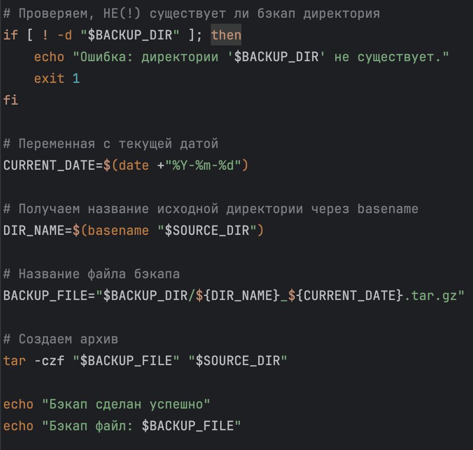
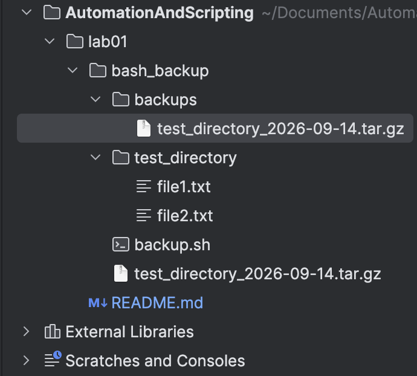
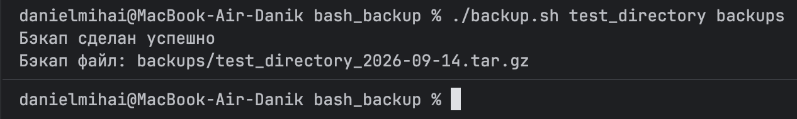
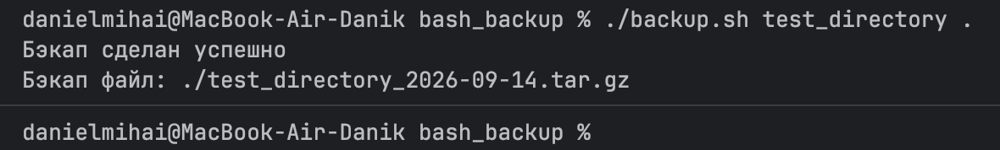

# Лабораторная работа №1

**Выполнил:** Михай Даниел, I2402
**Курс:** Automation and Scripting

---

## Задание

**1. Creating a backup of an important directory:**

1. The script should be named `backup.sh`;
2. The script should take two arguments: the path to the directory to back up and the path to the directory to save the backup;
3. The second argument should be optional and default to the directory `/backup`;
4. The script should create a `tar.gz` archive with the current date in the filename;
5. The script should check that the specified directories exist and output appropriate error messages.

---

## Описание скрипта

`backup.sh` — bash-скрипт для создания резервной копии указанной директории.

**Что делает скрипт:**
- Проверяет, что первый аргумент (директория для бэкапа) передан;
- Проверяет, что исходная директория существует;
- Если директория для сохранения бэкапа не указана — использует `/backup` по умолчанию; если такая директория не существует — создаёт её;
- Формирует имя архива на основе названия исходной директории и текущей даты;
- Создаёт `.tar.gz` архив исходной директории в директории бэкапа;
- Выводит сообщение об успешном завершении и путь к созданному файлу.

**Как использовать:**

```bash
./backup.sh <source_directory> [backup_directory]
```

- `<source_directory>` — обязательный аргумент, путь к директории, которую нужно забэкапить;
- `[backup_directory]` — необязательный аргумент, путь к директории для сохранения бэкапа. Если не указан — используется `/backup`.

**Примеры использования:**

```bash
# Бэкап в явно указанную директорию "backups"
./backup.sh test_directory backups

# Бэкап в текущую директорию
./backup.sh test_directory .

# Бэкап в директорию по умолчанию (/backup)
./backup.sh test_directory
```

---

## Код скрипта

```bash
#!/bin/bash
# shebang - говорит ОС, что этот файл нужно выполнить через bash

set -euo pipefail

# Проверяем условием, что если в переменной $1 нету названия папки, то выводим ошибку
if [ -z "$1" ]; then
    echo "Ошибка: путь директории неправильный."
    echo "Usage: ./backup.sh <source_directory> [backup_directory]"
    exit 1
fi

# Присваиваем переменной аргумент $1
SOURCE_DIR="$1"

# Если не указан второй аргумент, то мы сохраняем путь по /backup
# Если указан второй аргумент, то сохраняем название аргумента
BACKUP_DIR="${2:-/backup}"

if [ ! -d "$BACKUP_DIR" ]; then
    mkdir -p "$BACKUP_DIR"
fi

# Проверяем, НЕ(!) существует ли исходная директория
if [ ! -d "$SOURCE_DIR" ]; then
    echo "Ошибка: директории '$SOURCE_DIR' не существует."
    exit 1
fi

# Проверяем, НЕ(!) существует ли бэкап директория
if [ ! -d "$BACKUP_DIR" ]; then
    echo "Ошибка: директории '$BACKUP_DIR' не существует."
    exit 1
fi

# Переменная с текущей датой
CURRENT_DATE=$(date +"%Y-%m-%d")

# Получаем название исходной директории через basename
DIR_NAME=$(basename "$SOURCE_DIR")

# Название файла бэкапа
BACKUP_FILE="$BACKUP_DIR/${DIR_NAME}_${CURRENT_DATE}.tar.gz"

# Создаем архив
tar -czf "$BACKUP_FILE" "$SOURCE_DIR"

echo "Бэкап сделан успешно"
echo "Бэкап файл: $BACKUP_FILE"
```

---

## Что я делал по шагам

### 1. Написал первую часть скрипта — валидация аргументов

Реализовал проверку наличия первого аргумента (исходной директории), присвоение переменных `SOURCE_DIR` и `BACKUP_DIR` (со значением по умолчанию `/backup`), создание директории бэкапа, если её нет, и проверку существования исходной директории.

### 2. Дописал вторую часть скрипта — создание архива

Добавил проверку существования директории бэкапа, формирование имени файла архива на основе названия исходной директории и текущей даты (`date +"%Y-%m-%d"`), создание `.tar.gz` архива через `tar -czf` и вывод сообщений об успешном завершении.



### 3. Подготовил тестовую структуру проекта

Создал тестовую директорию `test_directory` с файлами `file1.txt` и `file2.txt`, а также папку `backups` для проверки работы скрипта с явно указанной директорией назначения.



### 4. Протестировал скрипт с указанной директорией бэкапа

Запустил `./backup.sh test_directory backups` — скрипт успешно создал архив `backups/test_directory_2026-09-14.tar.gz` и вывел сообщение об успехе.



### 5. Протестировал скрипт с директорией по умолчанию

Запустил `./backup.sh test_directory .` — скрипт успешно создал архив `./test_directory_2026-09-14.tar.gz` в текущей директории.



### 6. Результат

Скрипт `backup.sh` полностью соответствует требованиям задания: принимает обязательный и опциональный аргументы, проверяет существование директорий, создаёт архив с текущей датой в названии и выводит понятные сообщения об ошибках и успешном выполнении.